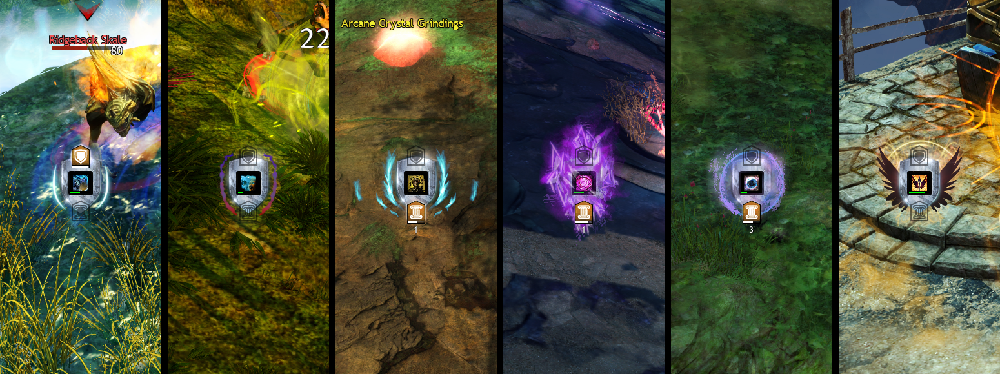

Reffect pack for Guild Wars 2. Requires https://github.com/Zerthox/gw2-reffect.

Simple indicator that brings key defensive effects like aegis, stability, and others into a standard, more prominent placement to help determine which hits you can tank vs ones you can't in the heat of battle. Rather than recreate all boons this instead focuses on the two that I want displayed very clearly at all times, combined with similar effects that can also prevent incoming damage.

Zip archive is available under Releases.

## Mitigation Types

Not all defensive effects are equal in Guild Wars 2. Some prevent hits from actually connecting, or simply reduce damage to 0, some negate condition damage, etc.

To help identify these differences across classes, I've organized effects into several standard categories that each have unique graphics while they are active, mostly corresponding with the floating text that you see during combat:

- **Block**: Completely prevents a hit, including any crowd control or applied conditions. This category activates for abilities that block as well as aegis. Note that some enemy abilities may be _unblockable_ however
- **Absorb**: Reduce incoming damage to 0, but usually you are still affected by any crowd control or conditions related to the incoming attack
- **Evade**: Bypass all incoming hits completely, just like during a dodge roll. Note that damaging conditions previously applied will keep ticking
- **Invulnerable**: Immune to all incoming attacks, as well as any damaging conditions previously applied. Distortion is listed in this pack separately to have special active graphics but it also provides invulnerability
- **Special**: Rebound and "We Will Never Yield" will prevent your health from reaching 0, however they will not mitigate all incoming damage

There are a few extra alternative active indicator graphics in the included icons that I ended up not using, feel free to swap them out to your liking. Additionally if you would like a more simplified graphic indicator that is the same for all types of mitigation, you can disable all of the "{category}-active" icons in each group and instead enable "category-active" in the "all" group.

## Preview

## Exceptions

The following skills do not apply a readable effect and thus **will not** show an accurate indicator that a block is active:

- **Guardian** Mace 3 - Protector's Strike
- **Guardian** Heal - Shelter
- **Revenant** Staff 3 - Warding Rift
- **Engineer** Hammer 4 - Shock Shield
- **Amalgam** Profession Skill - Defensive Protocol: Protect
- **Thief** Utility - Bandit's Defense
- **Elementalist** Magnetic Shield (bundle) 2 - Stone Sheath
